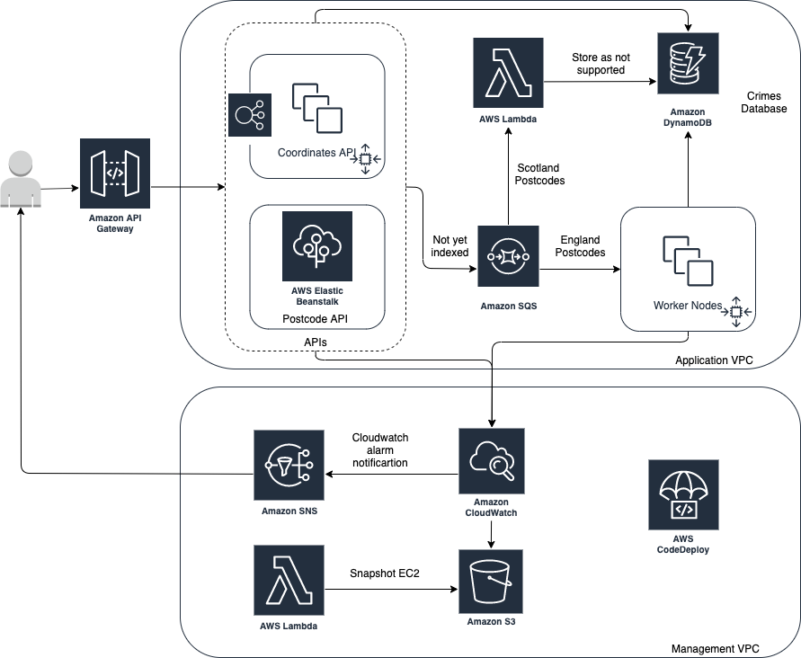

# AWS Certified DevOps Engineer - Professional

## Practical Exercise

### Requirements
To sufficiently cover the syllabus of the certification and demonstrate a practical application of
the areas covered in the Linux Academy course, my solution needs to include the following:
* EC2 autoscaling group - lifecycle hooks, terminal policies, snapshots, Backend?
* Elastic Beanstalk - Frontend?
* ELB - requests scale frontend Beanstalk, health checks, metrics
* SQS - scales worker node ASG
* Scaling policy based on metrics
* Cloudwatch Alarms with SNS
* Lambda - takes snapshot of EC2, maybe consumes something from SQS?
* S3 with Lifecycle
* Cross-account deployment pipelines using AWS Developer Tools
* DynamoDB - Something to do with state and concurrency locking for the backend
* All managed using IAM roles
* AWS Secrets Manager - Not sure yet
* API Gateway - Not sure yet
### Topology
Initial solution will look something like this:




### Postcode API (Frontend)
Takes a postcode, validates it, then sends it off to Amazon SQS instance. Returns 400 if postcode is invalid format.

Example Usage:
```cassandraql
curl -iva http://postcode-api-url/postcode/SE12FG
```


### Address Service (Backend)
Ingests postcode from Amazon SQS instance, looks up matching addresses, then stores them in dynamoDB.